# DATACO-SUPPLY-CHAIN-ANALYSIS

---

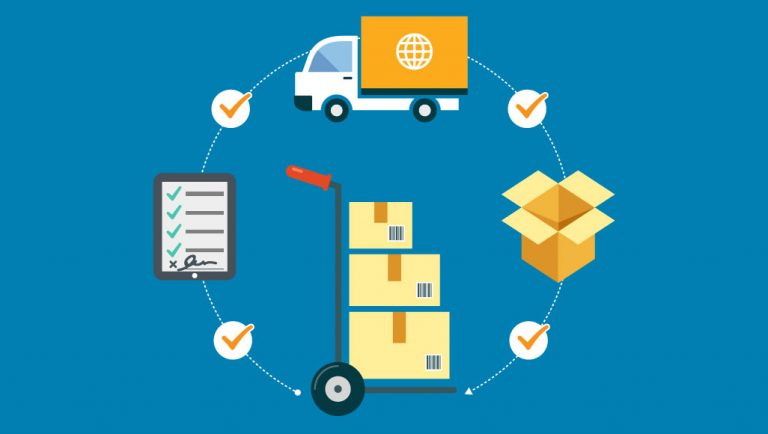

---

## Introduction

In today’s dynamic and competitive business landscape, the effective management of the supply chain is paramount for the success of any organisation. The ability to monitor, analyse, and optimise Key Performance Indicators (KPIs) within the supply chain can make the crucial difference in achieving operational excellence, customer satisfaction, and sustainable growth. This report delves into the essential aspects of the supply chain management, with a particular focus on the insights derived from three dashboards that was designed and developed.

---

## Purpose of Project

This report serves as a pivotal tool for the supply chain management team and executives, providing a clear map to enhance the organisations competitive edge. It provides a comprehensive understanding of customer segments, product preferences, and geographic factors, enabling the refinement of supply chain strategies to maximise profitability and customer satisfaction. Simultaneously, insights into the shipping practices and order processing times offer opportunities to optimise delivery processes, ensuring timely and efficient product deliveries. The combined effect of these insights empowers strategic decision-making that positively influences overall supply chain performance in a highly competitive market.

---

## Problem Statement

The challenges at hand lies in the need to comprehensively analyse the supply chain top-line key performance indicators (KPIs) and associated metrics. Identifying the driving factors behind these KPIs, pinpoint the influential customer segments, elucidate their product preferences, and elucidate how these preferences contribute to our total sales, ultimately leading to profitability.
Furthermore, it is important to determine the geographic origins of these customers, understand the specific market regions where they make purchases, and gauge the effectiveness of our shipping options ensuring timely product deliveries while mitigating late delivery occurrences. The processing time for customer orders is another variable of interest, and it must be investigated whether it has any bearing on how it meets delivery timelines or the occurrence of late deliveries.

---

## Limitation

- Lack of Cost Data: the dataset appears to be missing information about cost structure of the products and operations. Without cost data, it is challenging to calculate profit margins, which are crucial for a comprehensive financial analysis.
- Lack of Detailed Customer Demographic: while the dataset provides insights into customer segments, it may lack detailed demographic information about customers. This information can be valuable for tailoring marketing strategies and product offerings.

---

## Data Source

The original dataset for this project was obtained from Kaggle and its owner Fabian Constante(Instituto Politecnico de Leiria Escola Superior de Tecnologia e Gestao)  
Please click [here](https://data.mendeley.com/datasets/8gx2fvg2k6/5) to access data.

---

## Skills Demonstrated

SQL:

- Aggregate function
- Case function
- Alter/Drop/Rename(DDL)

Power Bi:

- Bookmarking
- DAX
- Calculated Columns
- Page Navigation
- Filters
- Tooltips
- Button

---
## Business Questions

Order Analysis:

- What are the trends in the number of orders over time, and do specific exhibit significant changes or seasonality?
- Are there any notable differences in order patterns among difference customer segment or product categories?
- How do order volumes correlate with sales, profit, and discount levels?

Sales and Profitability:
- Which products or product categories contribute the most to total sales and profitability
- Are there specific customer segments that generate a disproportionate share of sales and profit?
- How do discount levels impact sales and profitability, and is there an optimal discount strategy to maximize both?

Geographic:
- What geographical regions are the top performing cities in terms of total order volume and net sales?
- How do regional factors influence supply chain logistics and delivery times?

Shipping and Delivery Efficiency:
- What are the most commonly used shipping modes, and how do they relate to delivery timeliness?
- Is there a correlation between order processing times and delivery timeliness, and does it impact the rate of late deliveries?

---

## Data Exploration and Transformation

Data cleaning                                |                                   Data cleaning
:-------------------------------------------:|:----------------------------------------------:
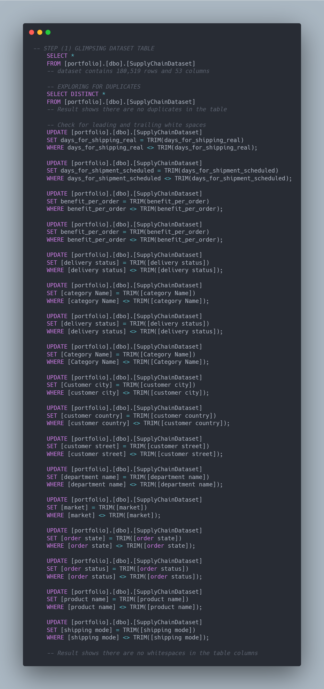                       |                          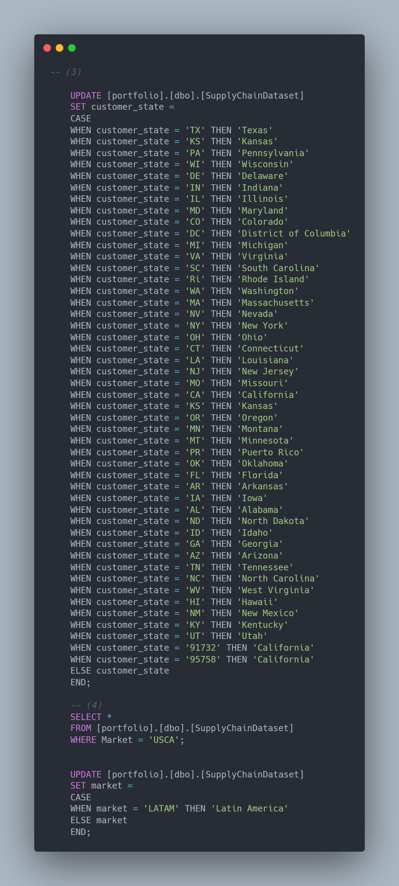

Data cleaning                                |                                   Data cleaning
:-------------------------------------------:|:----------------------------------------------:
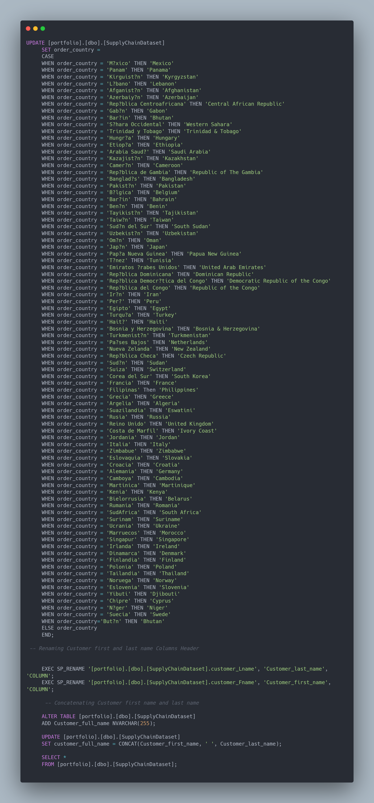                       |                          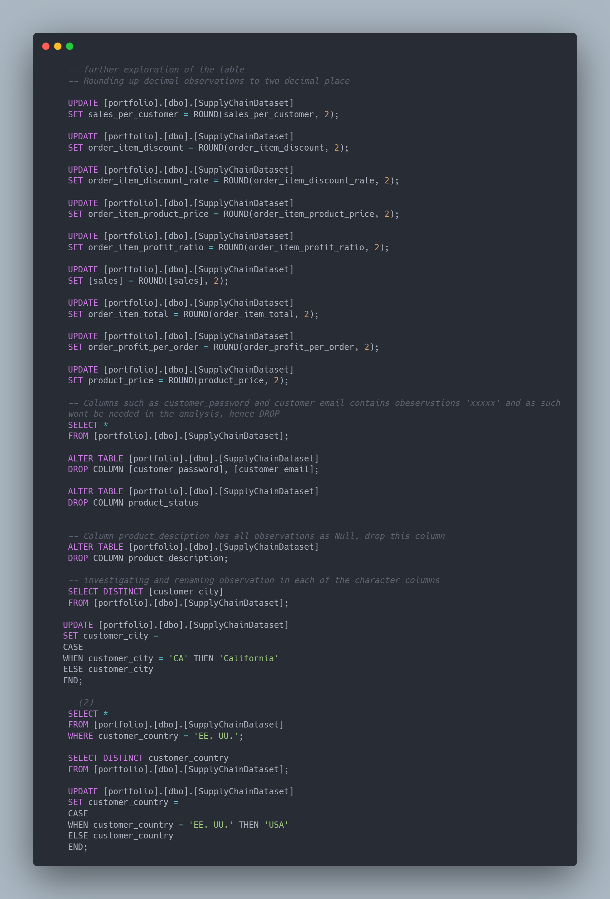

Data Exploration                             |                               Data exploration
:-------------------------------------------:|:----------------------------------------------:
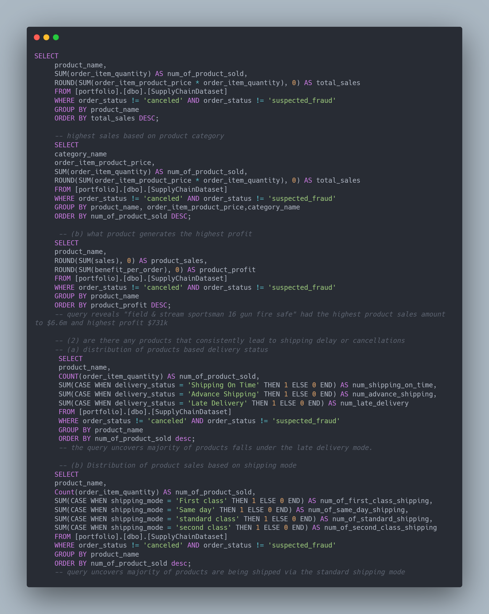                          |                          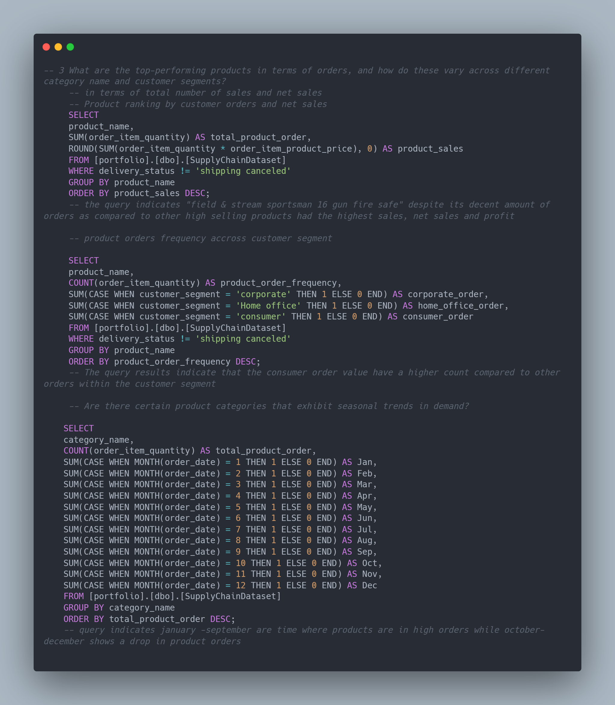

Data Exploration                             |                               Data exploration
:-------------------------------------------:|:----------------------------------------------:
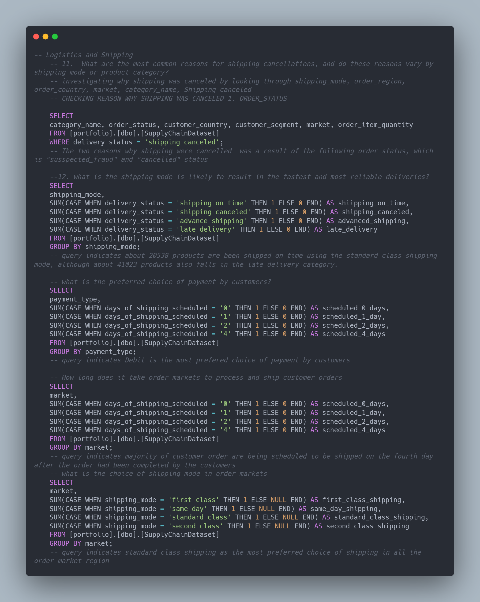                          |                          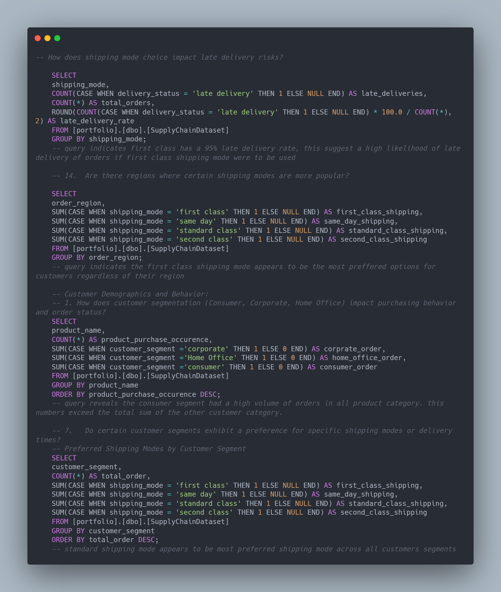

DAX                                          |                                           DAX
:-------------------------------------------:|:----------------------------------------------:
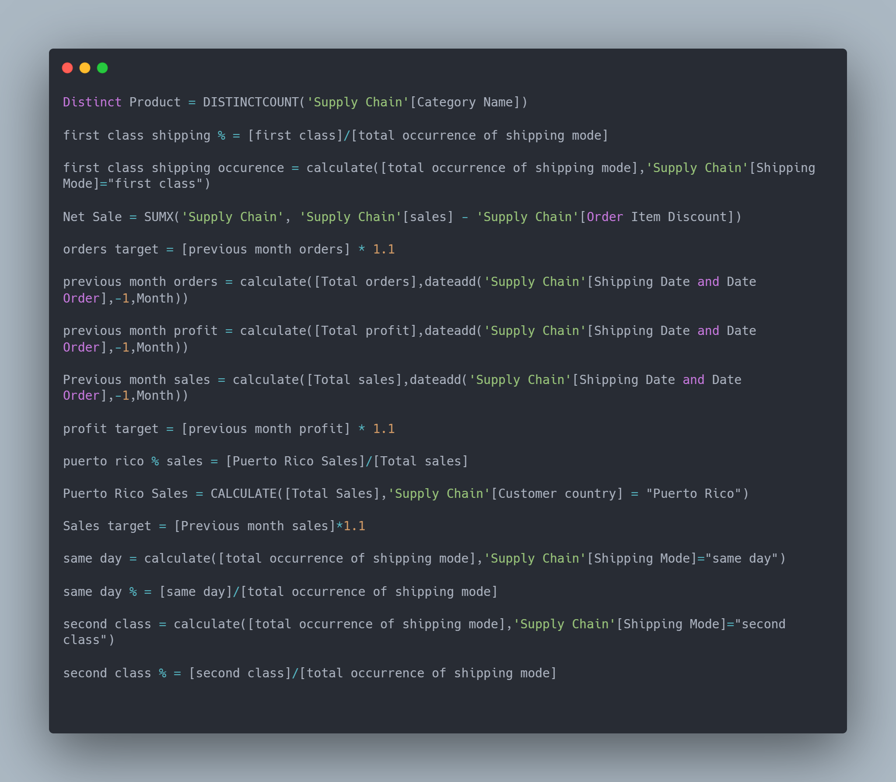                          |                          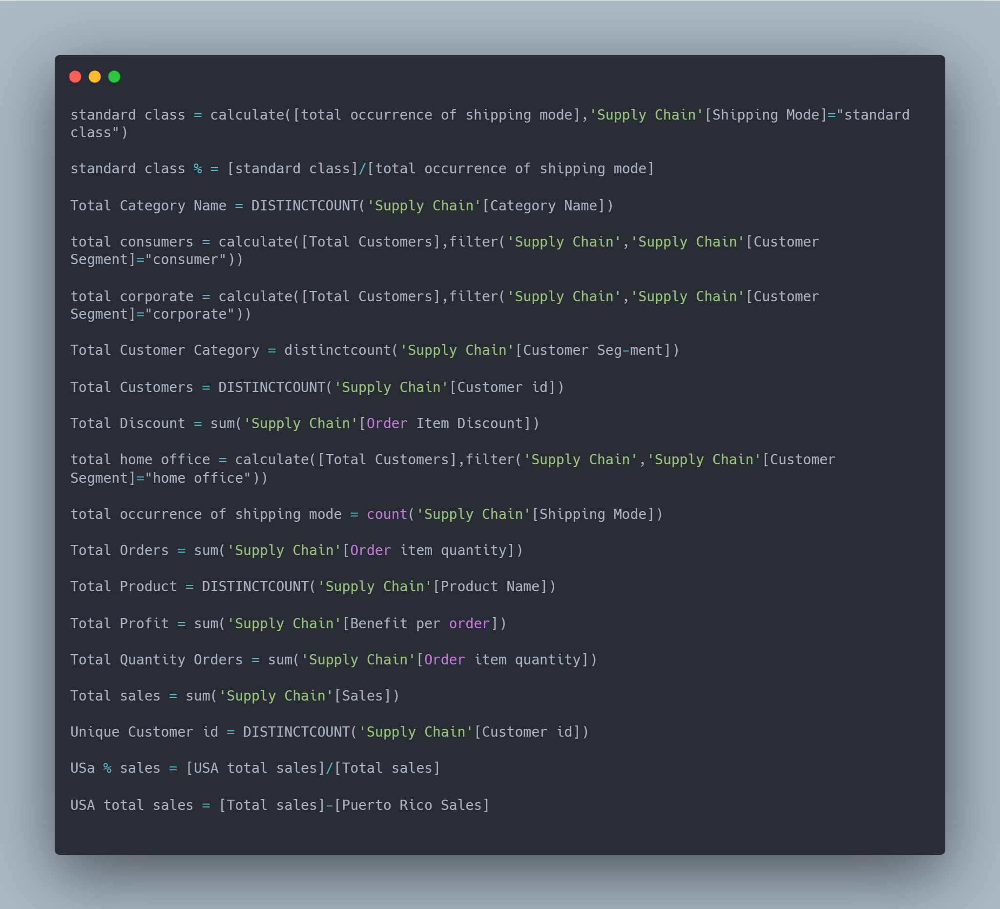

---

## Insights

Orders:

- Findings suggest that there are seasonal fluctuations in order volumes, with some quarters showing increases and others showing declines. The significant drop in orders in the fourth quarter of 2017 is a notable concern that requires further investigation to understand the reasons behind it.
It is essential to monitor and analyse the order trends and take action based on forecast and bounds to maintain healthy supply chain operations.
This analysis provides insights into historical order patterns, but the focus should be on addressing the causes of fluctuations, optimising supply chain processes, and considering the forecasting data to make informed decisions for the future.
- There are notable differences in order patterns among the three customer categories. While the consumers and corporate segments had the most number of orders, this category experienced a decline in orders over the years, the Home Office category had a low number of orders but maintained more stable order volumes.
The consistency in product categories ordered across all three customer categories indicates that certain product categories have universal appeal and may warrant special attention in marketing and inventory management efforts.
In summary, these insights highlight the ned for tailored strategies to address the unique order [patterns within the customer category and capitalise on product categories with broad customer appeal
- Across various product categories, it is interesting to note that the total discounts offered are approximately equivalent to the total profits earned for each category.
This suggests that while discounts are attracting customers and driving sales, they are also impacting profit margins. In some cases, profits are slightly higher than discounts, indicating that efficient cost management may be in place
Maintaining a balance between discounts to entice customers and ensuring healthy profit margins is crucial. Further analysis may be needed to determine the optimal discount strategy for each product category to maximise profitability.
In summary, this analysis highlights the relationship between order volumes, sales, discounts, and profits for different product categories. It underscores the importance of effectively managing discounts to achieve a balance between sales growth and maintaining healthy profit margins.

Sales and Profitability:

- The analysis reveals several top-performing products that significantly contribute to both total sales and profitability
“Field & Stream Sportsman 16 Gun fire Safe” stands out as the top-performing product in terms of both sales and profitability, followed closely by “perfect Fitness Perfect Rip Deck” and “Diamond Back Women’s Serene Classic Comfort Bike”
These products demonstrate the importance of product selection and marketing strategies in driving sales and profitability.
In conclusion, these insights help identify the products and categories that make the most substantial contributions to the organisation’s total sales and profitability, providing valuable guidance for strategic decision-making and resource allocation.
- Insights clearly highlights that the “Consumers” customer category generates a disproportionate share of both total sales and profit compared to the other two customer segments.
While “Corporate Customers” ad “Home Office” also contribute significantly to sales and profit, they are outperformed by the “Consumers” category, which stands out as the top-performing segment in terms of total orders, sales, net sales, and profit.
This information helps identify which customer segment is most impactful for the organisation’s revenue and profitability, providing valuable insights for strategic decision-making and resource allocation.
- Insights reveals that a uniform discount strategy was employed across all product categories. Each item received a 10% discount on its sale price
The discount strategy appears to have influenced the number of sales consistently across various product categories while the sales figures per item differ between product categories, the 10% discount had a relatively uniform impact on encouraging sales.
Notably, the profit per item closely aligns with the discount per item in many cases. For some product categories, profit per item is slightly higher than the discount, while in others, it’s slightly lower.
The finding suggest that the organisation was willing to reduce profit margins by offering discounts to stimulate sales. The balance between increasing sales and maintaining profitability is evident in the data, as the uniform discounts strategy implies.
In summary, the uniform 10% discount strategy had a consistent impact on sales across product categories, but finding the optimal discount strategy to maximise both sales and profit may require further analysis and consideration of factors such as segmentation and long-term sustainability. The data suggest a willingness to trade a portion of profit for increased sales, but striking the right balance remains a critical challenge

Geographic:

- Insights reveals the geographical regions where the business is thriving in terms of order volume and net sales.
Caguas in Puerto Rico, stands out as a key region with substantial sales and profitability, indicating potential opportunities for further growth and investment in this region.
Chicago and Los Angeles are also prominent markets, warranting continued attention and strategic FOCU.
Other states, while having fewer orders, still make meaningful contributions to the business’s overall performance.
Overall, insight provided valuable information for making informed decisions about resource allocation, marketing strategies, and growth initiatives based on the performance of these top-performing cities
- Insight does not strongly indicate that regional factors are primary cause of delivery timeliness issues, it suggest that the organisation’s internal processes may be responsible for the observed pattern of delivery. The consistent delays in shipping, which occur across all customer cities in the dataset, point to internal operational challenges.
The insight highlights a consistent pattern of orders being shipped several days after the orders were completed by customers, regardless of customer’s location.
While regional factors can influence logistics to some extent, the uniformity of the shipping delay patterns across all cities in the dataset indicates organisation-wide concern.
In summary, the insight suggests that internal operational issues within the organisation play a significant role in delivery timeliness concerns, rather than regional factors. Addressing these internal challenges should be a key focus for improving supply chain logistics and delivery times.

Standard and Delivery Efficiency:

- The standard shipping mode stands out as the most preferred option with 108,000 customer orders, indicating its popularity, however, it is important to note that a significant portion (42,000 orders) falls under the late delivery, scheduled for shipping on the third and fourth day after the initial order completion. This suggests that while it is commonly used, there are challenges in ensuring timely delivery with standard shipping.
The first class shipping, is the second most commonly used shipping mode, with 35,000 customer orders. This mode also exhibits variability in delivery timeliness, with only 7k orders shipped on time while 28k orders falls under the late delivery, scheduled for shipping third, fourth, fifth and sixth day after the initial order completion.
First class shipping, with 28,000 customer orders. A majority of these orders (27,000 orders) experienced delays, typically being shipped on the third day after the initial order completion.
Same day shipping, while having a significant number of customer orders(10,000), also faces challenges with delivery timeliness. A portion of these orders(5,000) is shipped on time (same day), while another portion (5,000) experience delays, typically being shipped on the third day.
- There is a correlation between order processing times and delivery timeliness. For example, orders with faster processing times(e.g., same-day or next day) tend to be delivered more promptly.
The high number of orders categorised as late delivery, particularly in standard shipping, suggest that there is room for improvement in processing times and delivery efficiency.
The correlation between order processing times and delivery timeliness impacts the rate of late deliveries. Orders with longer processing times, such as third, fourth, fifth or sixth day, have a higher likelihood of being late, as indicated by the significant number of orders that falls in these categories.
On-time processing, such as same-day or next-day shipping, significantly reduces the rate of late deliveries

---

## Recommendations

- Instead of applying the same 10% discount uniformly to all products, business should consider segmenting products based on factors such as customer preferences, product category, and demand elasticity. Some products may benefit from higher discounts, while others may not require any discount at all.
- Business should consider tailoring discount offers to different customer segments. For example, loyalty discounts can be offered to more frequent consumer buyers to encourage repeat purchases.
- Business should consider tailoring marketing strategies to target these high-performing customer regions more effectively.
- Forster strong relationships with customers In these regions through targeted engagement initiatives. This can include loyalty programs, exclusive offers, and personalised customer support.
- Business should consider conducting review processes related to order fulfilment, logistics, and shipping. This needs to be done to identify bottlenecks and inefficiencies that may be causing delays in order shipments.
- Business needs to review and optimise the processes involved in standard shipping to reduce delays. Implements measures to streamline order processing and shipment preparation.
- Business needs to gather feedback from customers who have chosen first-class shipping to understand their expectations and areas where improvements are needed. This feedback will be used to refine the shipping process.
- Business should consider diversifying into emerging customer regions to reduce reliance on specific regions. Explore customer regions that have shown growth potential.

---

## Visualisation

I have created two dashboard from this dataset.

- Executive Dashboard:

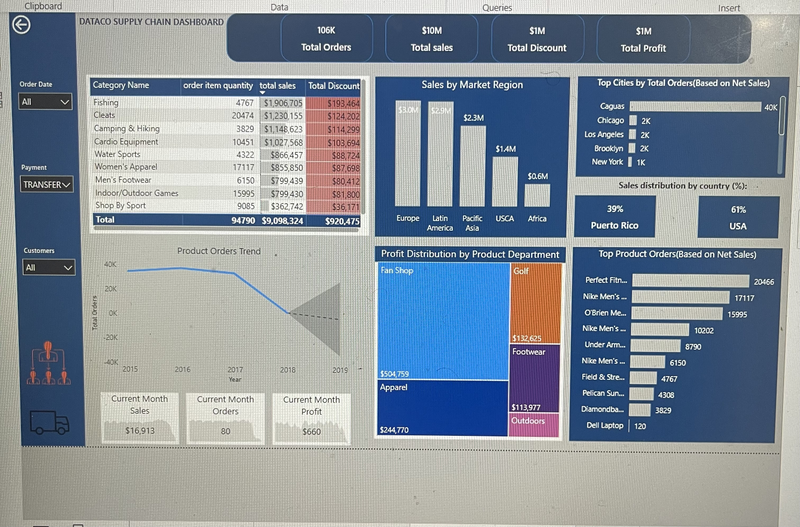

- Shipping Dashboard:

  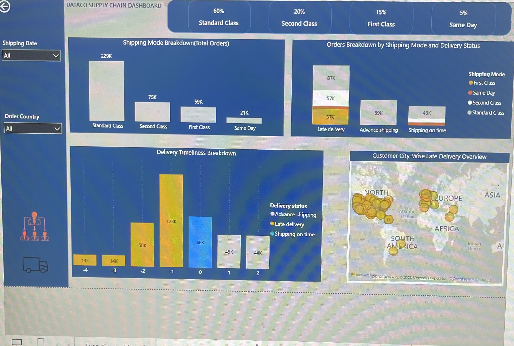

To interact with the dashboards, please click [here](https://app.powerbi.com/links/BRLtnaxsME?ctid=e757cfdd-1f35-4457-af8f-7c9c6b1437e3&pbi_source=linkShare&bookmarkGuid=4bbd7983-9bda-45b2-a1f7-82d6c316b58f)

Thank you!
